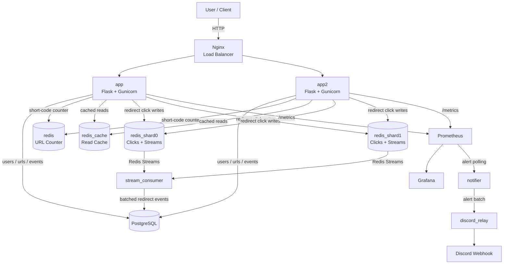

# Curtain

Curtain is a Flask service for URL shortening, redirect tracking, analytics, and incident-response demos. The current runtime architecture uses PostgreSQL for durable data, Redis for counters and cache, sharded Redis instances for real-time click collection, Nginx for load balancing, and Prometheus/Grafana for monitoring.

## Architecture Diagram



## Build Instructions

### Prerequisites

- Docker and Docker Compose
- Optional for local non-Docker runs: `uv`, Python 3.13, PostgreSQL, and Redis

### Start the Full Stack

```bash
docker compose up --build -d
curl http://localhost:5000/health
```

### Seed Challenge Data

```bash
docker compose exec app uv run python scripts/reset_db.py
docker compose exec app uv run python scripts/seed_csv.py
```

### Local Python Workflow

```bash
uv sync --dev
uv run python run.py
```

## [IMPORTANT] Evidence of Hackathon Quest

- Reliability: [evidence/RELIABILITY_EVIDENCE.md](evidence/RELIABILITY_EVIDENCE.md)
- Scalability: [evidence/SCALABILITY_EVIDENCE.md](evidence/SCALABILITY_EVIDENCE.md)
- Incident response: [evidence/INCIDENT_RESPONSE_EVIDENCE.md](evidence/INCIDENT_RESPONSE_EVIDENCE.md)

## Current Architecture

### Application Layer

- Two Flask app containers: `app` and `app2`
- Each app container runs Gunicorn with 2 workers
- Nginx fronts both app containers and exposes the service on `http://localhost:5000`

### Data Layer

- PostgreSQL stores `users`, `urls`, and `events`
- `redis` stores the monotonic URL counter used for short-code generation
- `redis_cache` stores cached JSON responses
- `redis_shard0` and `redis_shard1` store sharded redirect counters, hourly buckets, HyperLogLog unique-visitor sketches, and Redis Streams entries

### Background and Monitoring Services

- `stream_consumer` drains Redis Streams and writes redirect events to PostgreSQL
- `prometheus` scrapes `/metrics` from both app containers
- `grafana` visualizes app and incident-response metrics
- `notifier` polls Prometheus alerts and forwards new firing alerts
- `discord_relay` translates internal alert payloads into Discord webhook posts

## Request Flow

### URL Creation

1. `POST /urls` validates the request body.
2. The app tries to allocate the next short code from Redis key `url:counter`.
3. If the counter Redis is unavailable, the app falls back to PostgreSQL max-id state.
4. The new URL is persisted in PostgreSQL.
5. A `created` event is written to PostgreSQL.
6. Related cache keys are invalidated.

### Redirects

1. `GET /r/<short_code>` or the alias redirect routes resolve the URL, using cached redirect metadata when available.
2. The app records the click into the owning Redis shard:
   - total counter
   - hourly bucket
   - HyperLogLog unique visitors
   - Redis Stream append
3. The app writes an immediate `redirect` event to PostgreSQL.
4. The client receives a `302` redirect to the original URL.

### Analytics and Cached Reads

- `GET /urls`
- `GET /urls/<id>`
- `GET /urls/<id>/analytics`

These routes use `redis_cache` as a read-through cache and return `X-Cache: HIT`, `MISS`, or `BYPASS` depending on the path.

## API Surface

### Core Routes

- `GET /health`
- `GET /metrics`
- `GET /`
- `POST /shorten-ui`

### Users

- `POST /users/bulk`
- `GET /users`
- `GET /users/<id>`
- `POST /users`
- `PUT /users/<id>`
- `DELETE /users/<id>`

### URLs

- `POST /urls`
- `GET /urls`
- `GET /urls/<id>`
- `PUT /urls/<id>`
- `DELETE /urls/<id>`
- `GET /r/<short_code>`
- `GET /urls/short/<short_code>`
- `GET /urls/<short_code>/redirect`

### Events and Analytics

- `GET /events`
- `GET /events/<id>`
- `POST /events`
- `GET /urls/<id>/analytics`

## Environment Variables

Common settings are listed in [`.env.example`](.env.example).

Important runtime variables:

- `DATABASE_URL`
- `REDIS_URL`
- `CACHE_REDIS_URL`
- `REDIS_SHARDS`
- `ENABLE_INCIDENT_DEBUG_ROUTES`
- `DISCORD_WEBHOOK_URL`
- `GRAFANA_ADMIN_USER`
- `GRAFANA_ADMIN_PASSWORD`

## Testing

Run the test suite locally:

```bash
uv sync --dev
uv run pytest --cov=app --cov-report=term-missing
```

Run it inside Docker:

```bash
docker compose exec app uv sync --dev
docker compose exec app uv run pytest -q
```

## Project Structure

```text
Curtain/
├── app/
│   ├── __init__.py
│   ├── cache.py
│   ├── database.py
│   ├── observability.py
│   ├── redis_client.py
│   ├── shard_ring.py
│   ├── stream_consumer.py
│   ├── models/
│   ├── routes/
│   ├── services/
│   └── templates/
├── docs/
├── evidence/
├── loadtests/
├── monitoring/
├── nginx/
├── scripts/
├── tests/
├── docker-compose.yml
├── gunicorn.conf.py
├── pyproject.toml
└── run.py
```

## Documentation

- API examples: [docs/API_EXAMPLES.md](docs/API_EXAMPLES.md)
- Error handling: [docs/ERROR_HANDELING.md](docs/ERROR_HANDELING.md)
- Failure modes: [docs/FAILURE_MODES.md](docs/FAILURE_MODES.md)
- Incident response: [docs/INCIDENT_RESPONSE.md](docs/INCIDENT_RESPONSE.md)
- Root-cause diagnosis: [docs/DIAGNOST_ERRORS.md](docs/DIAGNOST_ERRORS.md)
- Load testing: [docs/LOAD_TESTING.md](docs/LOAD_TESTING.md)
- Observability: [docs/OBSERVABILITY.md](docs/OBSERVABILITY.md)
- Runbook: [docs/RUNBOOK.md](docs/RUNBOOK.md)
- Redis details: [docs/REDIS_INFO.md](docs/REDIS_INFO.md)
