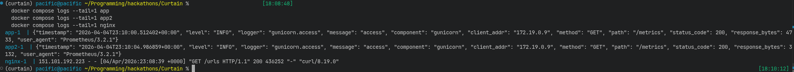
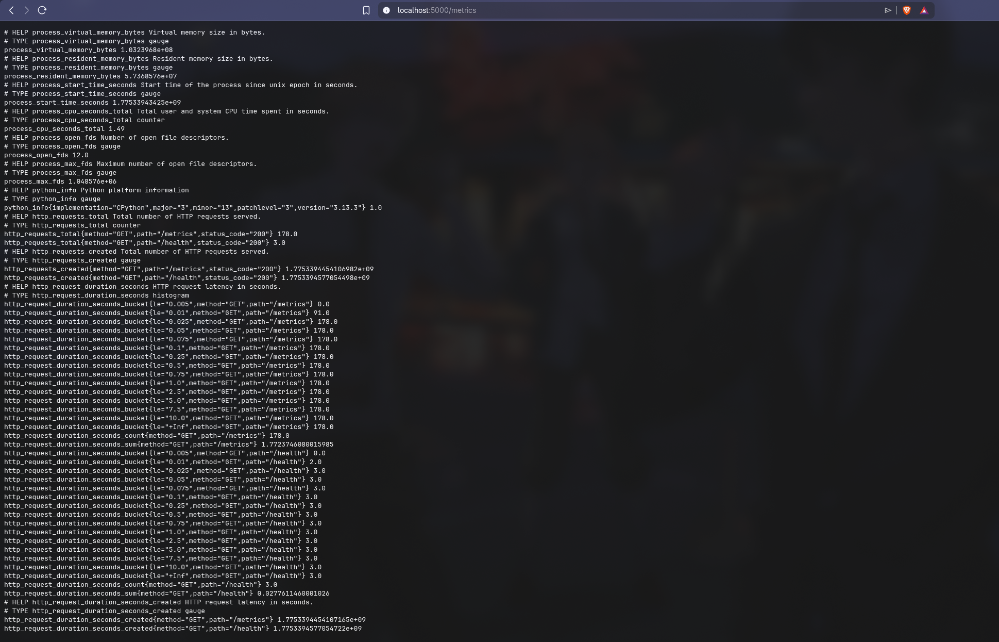
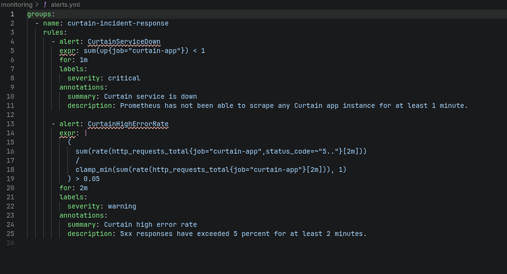
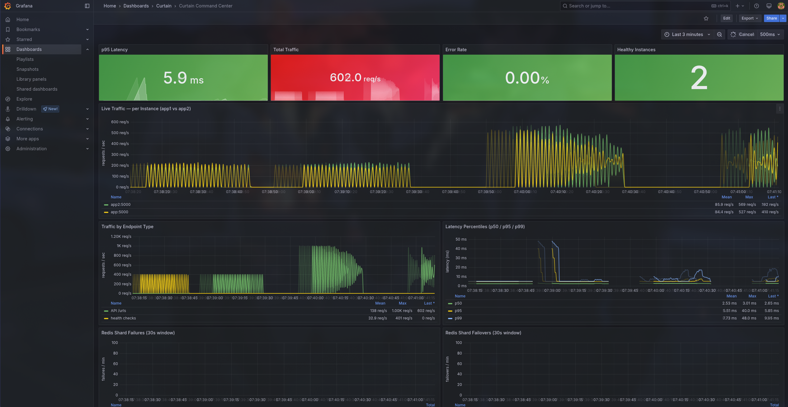

# Incident Response Quest Evidence

This document maps the current Curtain implementation to the Incident Response quest tiers and links the supporting documentation for each tier.

## Bronze Evidence

Bronze is about replacing ad-hoc prints with structured visibility: JSON logs, metrics, and a way to inspect the system without logging into the host directly.

Below is a screenshot of the JSON logs produced by the service.

Below is a screenshot of the metrics page exposed by the application.

These demonstrate that the app emits structured JSON logs with timestamps and levels, and exposes a metrics endpoint that Prometheus can scrape for service and process signals.

Relevant docs:

- [../docs/OBSERVABILITY.md](../docs/OBSERVABILITY.md) explains the JSON log format, the `/metrics` endpoint, and how to inspect logs with Docker instead of SSH.
- [../docs/API_EXAMPLES.md](../docs/API_EXAMPLES.md) includes simple examples for hitting `/health` and `/metrics`.

## Silver Evidence

Silver is about alerting: defining failure rules, wiring notifications, and proving that incidents reach a human-visible channel quickly.

We will show the live alert demo in the project submission video, where a simulated failure results in a Discord notification.

Below is a screenshot of the alert logic configuration located in [../monitoring/alerts.yml](../monitoring/alerts.yml).

This evidence supports the current alert setup for service-down and high-error-rate scenarios, along with the notification path that forwards alerts to Discord.

Relevant docs:

- [../docs/INCIDENT_RESPONSE.md](../docs/INCIDENT_RESPONSE.md) explains the Prometheus, notifier, and Discord relay flow and documents the active alert rules.
- [../docs/RUNBOOK.md](../docs/RUNBOOK.md) describes what to check when one of the alerts fires and how to recover the service.

## Gold Evidence

Gold is about full situational awareness: a dashboard, a runbook, and the ability to diagnose a problem using telemetry rather than guesswork.

Below is a screenshot of the Grafana dashboard while the system is under load.

This dashboard is used to track the key operational signals needed for debugging, including request latency, traffic volume, error behavior, and process-level saturation indicators.

Runbook:

- [../docs/RUNBOOK.md](../docs/RUNBOOK.md) is the “in case of emergency” guide for active alerts, first checks, and recovery actions.

Sherlock mode explanation:

We use the dashboard to identify the failure pattern first, such as traffic collapsing, error rate spiking, or saturation dropping. Then we correlate those time windows with structured logs and container state to determine whether the problem is in the app tier, the alerting path, or a backing dependency.

Relevant docs:

- [../docs/DIAGNOST_ERRORS.md](../docs/DIAGNOST_ERRORS.md) documents a dashboard-and-logs-only diagnosis workflow for a simulated outage.
- [../docs/INCIDENT_RESPONSE.md](../docs/INCIDENT_RESPONSE.md) explains the monitoring stack and fire-drill flow.
- [../docs/OBSERVABILITY.md](../docs/OBSERVABILITY.md) explains which logs and metrics are available during diagnosis.
