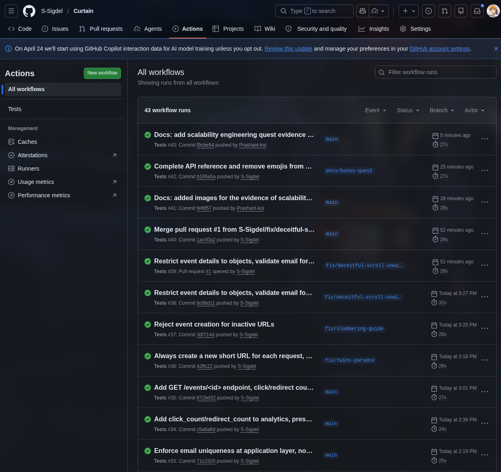
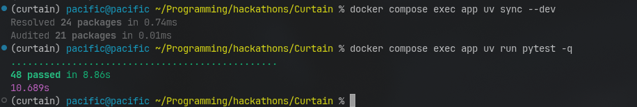
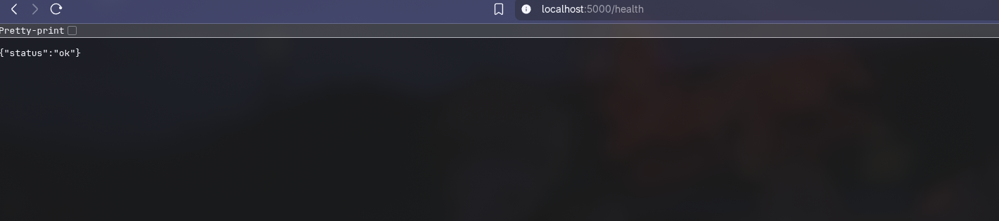
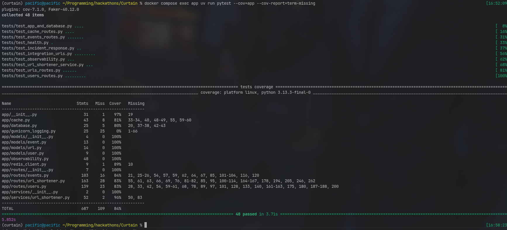
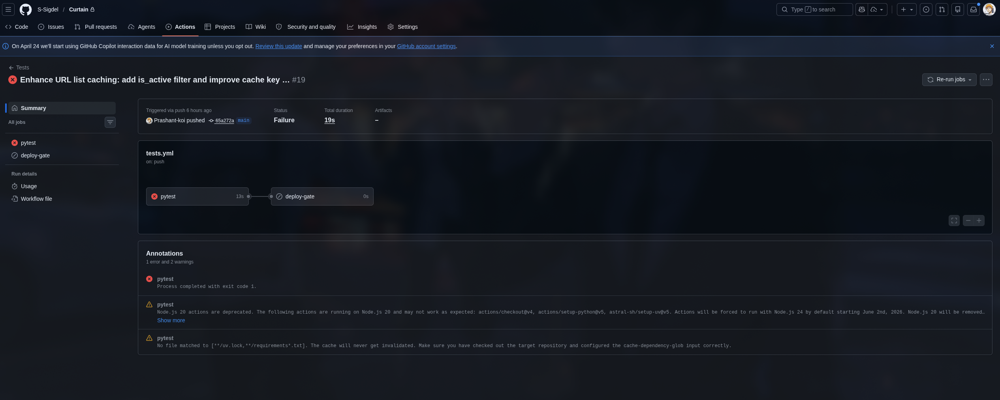

# Reliability Engineering Quest Evidence
We have completed the reliability engineering quest up to the Gold level. This document captures the evidence for each level and demonstrates the reliability measures implemented in our system.

## Bronze Evidence
Below are the GitHub Actions CI logs showing passing tests after every push.

Below is an image of pytest running and completing all unit and integration tests.

Below is image evidence of a working GET `/health` endpoint.

## Silver Evidence
Below is the coverage report showing 84% coverage, which fulfills the requirements of both the Gold and Silver tiers.

Below is a screenshot of GitHub Actions blocking deployment due to a failed test.

## Gold Evidence
We will show the live demos in our submission demo video.

The Failure Modes documentation is linked here: [./docs/FAILURE_MODES.md](../docs/FAILURE_MODES.md)
