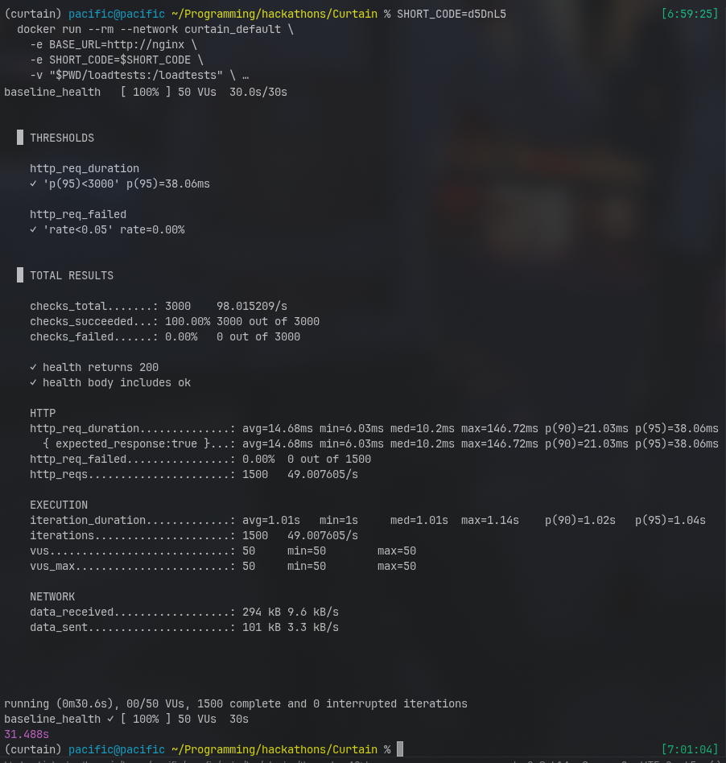
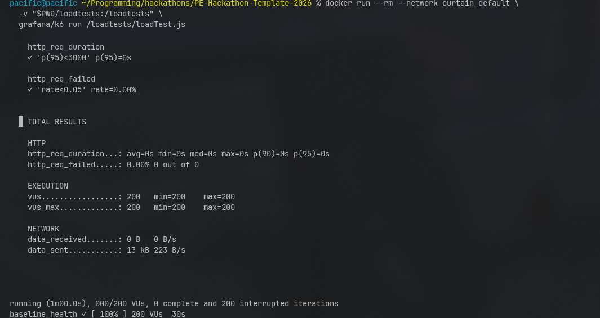
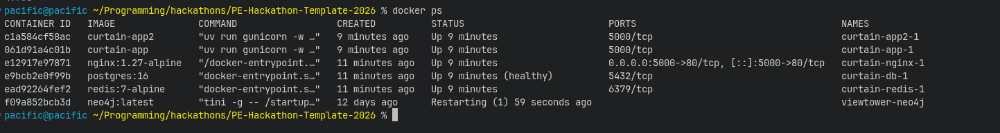
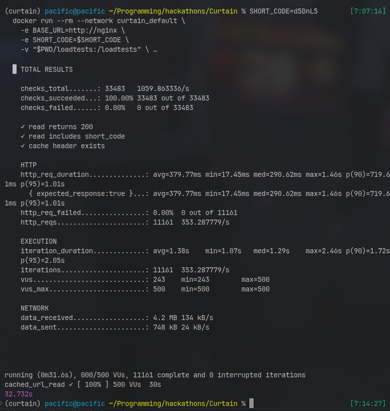
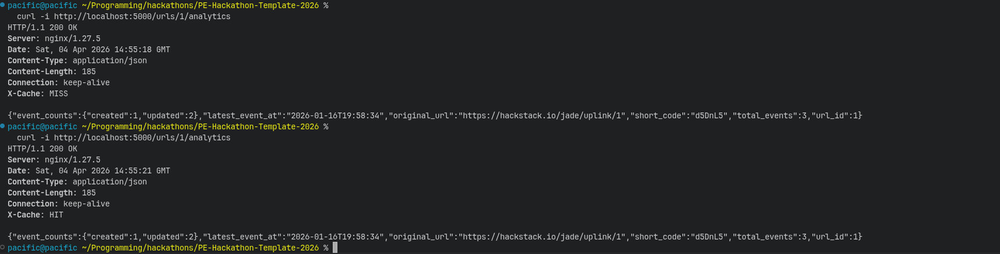

# Scalability Engineering Quest Evidence
We have completed the scalability engineering quest up to the gold level, and we used `k6` to simulate concurrent users. We are using `Nginx` to load-balance two instances of our app container, and we are also using `Redis` to generate unique short-form URLs by using it as a counter. In addition to the database, we use `Redis` to keep a time-to-live (TTL) cache of the most-used short URLs to make access faster. We have also cached analytics.

## Bronze Evidence
Below is the image showing 50 concurrent users hitting our program.

## Silver Evidence
Below is the image showing 200 concurrent users hitting our program.

Below is the image showing two instances of our app running (curtain-app2-1 and curtain-app-1) along with `curtain-nginx-1` which is working as the load balancer for the two instances.

## Gold Evidence
Below is the image showing 500 concurrent users hitting our program.

Below is the image showing the analytics for `url_id:1` being cached. In the first curl request, `X-Cache` is `MISS`, which means the result was not found in the cache and had to be fetched from PostgreSQL. In the second curl request, `X-Cache` is `HIT`, which means after the first `MISS`, the result was cached in `Redis` and then found there on the second call. This proves that the caching mechanism is working.
